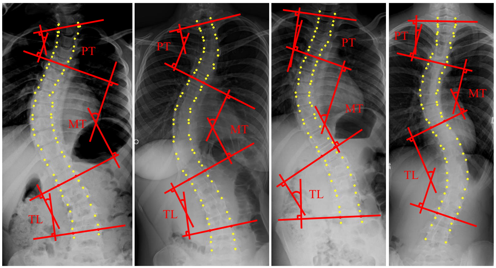
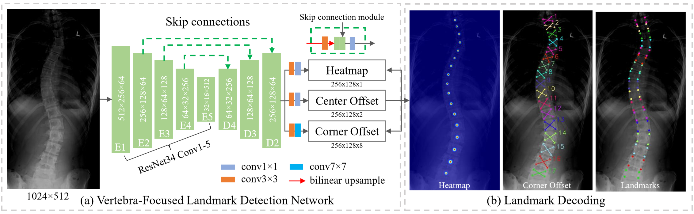

# Vertebra-Focused-Landmark-Detection-Pytorch
Vertebra-Focused Landmark Detection for Scoliosis Assessment   [[arXiv](https://arxiv.org/pdf/2001.03187.pdf)]

Accepted to ISBI2020.


Please cite the article in your publications if it helps your research:

	@article{yi2020vertebra,
	  title={Vertebra-Focused Landmark Detection for Scoliosis Assessment},
	  author={Yi, Jingru and Wu, Pengxiang and Huang, Qiaoying and Qu, Hui and Metaxas, Dimitris N},
	  booktitle={ISBI},
	  year={2020}
	}


<p align="center">
	
</p>

<p align="center">
	
</p>

# Dependencies
Ubuntu 14.04, Python 3.6.4, PyTorch 1.1.0, OpenCV-Python 4.1.0.25 

# How to start
## Prepare Dataset
To directly use dataset.py, you can arrange the dataset as follows:
```
/dataPath/data
	/train/*.jpg
	/val/*.jpg
	/test/*.jpg
/dataPath/labels/
	/train/*.mat
	/val/*.mat
	/test/*.mat
```
The source dataset is from [[dataset16] (http://spineweb.digitalimaginggroup.ca/spineweb/index.php?n=Main.Datasets#Dataset_16.3A_609_spinal_anterior-posterior_x-ray_images)].
To adapt the code to your own dataset, you can modify the dataset.py, for example, change the 'load_gt_pts' function to adapt it to your own annotations.
	
## Train the model
```ruby
python main.py --data_dir dataPath --epochs 50 --batch_size 2 --dataset spinal --phase train
```

## Test the model
```ruby
python main.py --resume weightPath --data_dir dataPath --dataset spinal  --phase test
```


## Evaluate the model
```ruby
python main.py --resume weightPath --data_dir dataPath --dataset spinal --phase eval
